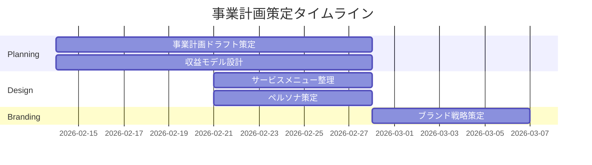

# Project: 自社事業計画策定

## Executive Summary
**一行説明**: DX/AIコンサルティング事業の法人化に向けた事業計画・収益モデル・サービス設計の策定

**プロジェクトの目的**: 現在のフリーランスDXコンサルタントとしての実績（NTTDXパートナー11件以上）を基盤に、法人化後の事業戦略を体系的に整理し、持続的成長モデルを設計する

**想定成果**: 事業計画書、収益モデル、サービスメニュー、ターゲットペルソナ、ブランド戦略の各ドキュメント完成

## Goals & Success Metrics

### Primary Goals
1. 法人化後の事業ドメインとサービスラインを明確化する
2. Year1-3の収益計画とキャッシュフロー予測を策定する
3. ブランドポジショニングとターゲット顧客を定義する

### Success Criteria
- [ ] 事業計画書ドラフト完成（Year1-3の収益計画含む）
- [ ] 4つのサービスラインの定義と価格設定完了
- [ ] ターゲットペルソナ3-4パターンの策定完了
- [ ] ブランド戦略・社名候補の整理完了

## Stakeholders

| Role | Name | Responsibility |
|------|------|----------------|
| Owner | user | 全体統括・意思決定 |
| Partner | NTTDXパートナー | DXコンサル案件供給 |
| Advisor | 税理士・社労士 | 法人設立手続き支援 |

## Deliverables

### Main Deliverables
- [ ] 成果物1: 事業計画書ドラフト
  - 詳細: [[01-planning/事業計画書-ドラフト]]
  - 期限: 2026-03-01

- [ ] 成果物2: 収益モデル設計
  - 詳細: [[01-planning/収益モデル設計]]
  - 期限: 2026-03-01

- [ ] 成果物3: サービスメニュー整理
  - 詳細: [[01-planning/サービスメニュー整理]]
  - 期限: 2026-03-01

- [ ] 成果物4: ターゲット顧客ペルソナ
  - 詳細: [[01-planning/ターゲット顧客ペルソナ]]
  - 期限: 2026-03-01

- [ ] 成果物5: ブランド戦略・ネーミング
  - 詳細: [[01-planning/ブランド戦略・ネーミング]]
  - 期限: 2026-03-01

## Timeline & Milestones

### Key Milestones
- [ ] Milestone 1: (2026-03-01) 事業計画書ドラフト完成
  - 達成条件: 全セクション記入、数値計画確定

- [ ] Milestone 2: (2026-03-15) ステークホルダーレビュー完了
  - 達成条件: 税理士・パートナーからのフィードバック反映

- [ ] Milestone 3: (2026-04-01) 法人設立申請準備完了
  - 達成条件: 定款・登記書類の準備完了

## Current Status

**Overall Progress**: 20%

[████░░░░░░░░░░░░░░░░] 20%

### This Week's Focus
- 事業計画書ドラフト作成
- 収益モデルの数値シミュレーション

### Blockers & Risks
- 社名の最終決定が法人登記に影響
  - Impact: 中
  - Mitigation: 複数候補を早期に絞り込み

## Budget & Resources

### Budget
- 予算: ¥500,000（法人設立関連費用）
- 実績: ¥0
- 残高: ¥500,000

### Required Resources
- [ ] 人的リソース: 税理士、社労士
- [ ] ツール・サービス: 会計ソフト、法人口座
- [ ] 外部発注: ロゴデザイン、Webサイト制作

## Related Documents
- [[05_Output/Projects/@Active/Own-Company-Incorporation/00-プロジェクト概要|法人設立プロジェクト]]
- [[04_Memory/Business/_Business-MOC|Business MOC]]
- [[04_Memory/Business/Sales/pricing-strategy|プライシング戦略]]
- [[05_Output/Areas/Business/Corporate-Training/00-service-overview|企業研修サービス]]
- [[05_Output/Areas/Business/RIDE-ON-AI/00-community-strategy|RIDE ON AI コミュニティ]]
- [[05_Output/Areas/Business/Survibe-AI-Baib-Coding-School/00-business-model|Survibe AI ビジネスモデル]]

## Project Log

### 2026-02-14 - プロジェクト開始
- 事業計画・収益モデル・サービス設計ドキュメントの初版を作成

## Next Actions
- [ ] 事業計画書の数値を精査・更新
- [ ] 税理士との初回面談をスケジュール
- [ ] 社名候補のドメイン空き状況を調査
