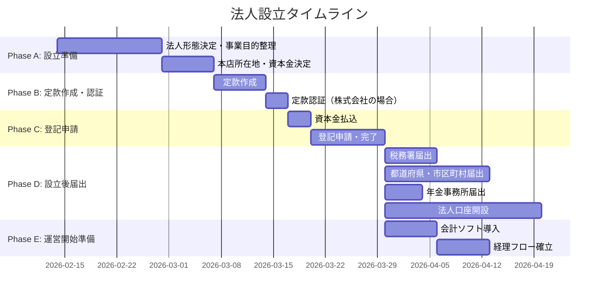

# Project: 自社法人設立

## Executive Summary
**一行説明**: 個人事業から法人化し、事業基盤を整備する

**プロジェクトの目的**:
- 事業の信用力向上と節税効果を目的として法人を設立する
- **合同会社（LLC）に決定**（2026-02-14）。最短で設立完了する
- 設立後の届出・運営体制を確立する

**想定成果**:
- 法人登記完了
- 法人口座開設
- 各種届出完了
- 経理・税務の運営体制確立

## Goals & Success Metrics

### Primary Goals
1. 法人形態を決定し、設立登記を完了する
2. 税務・社会保険の届出をすべて期限内に完了する
3. 法人として事業運営を開始できる体制を整える

### Success Criteria
- [ ] 法人登記完了
- [ ] 法人口座開設完了
- [ ] 税務署・都道府県・年金事務所への届出完了
- [ ] 会計ソフト導入・初期設定完了
- [ ] 法人印鑑セット取得済み

## Stakeholders

| Role | Name | Responsibility |
|------|------|----------------|
| Owner | ttygtd | 全体統括・意思決定 |
| 司法書士 | （未定） | 定款認証・登記手続き ※要専門家確認 |
| 税理士 | （未定） | 税務届出・顧問契約 ※要専門家確認 |
| 社会保険労務士 | （未定） | 社会保険手続き ※要専門家確認 |

## Deliverables

### Main Deliverables
- [ ] 成果物1: 法人形態の決定
  - 詳細: 合同会社 vs 株式会社の比較検討を完了し、最適な形態を選定
  - 期限: 2026-02末

- [ ] 成果物2: 定款作成・認証
  - 詳細: 事業目的・本店所在地・資本金等を決定し、定款を作成
  - 期限: 2026-03中旬

- [ ] 成果物3: 法人登記完了
  - 詳細: 法務局への設立登記申請・完了
  - 期限: 2026-03末

- [ ] 成果物4: 各種届出完了
  - 詳細: 税務署・都道府県税事務所・年金事務所等への届出
  - 期限: 2026-04末

## Timeline & Milestones

### Key Milestones
- [ ] Milestone 1: (2026-02末) 法人形態決定
  - 達成条件: 合同会社 or 株式会社を選定し、事業目的リストを確定

- [ ] Milestone 2: (2026-03中旬) 定款認証完了
  - 達成条件: 公証役場での定款認証が完了（株式会社の場合）

- [ ] Milestone 3: (2026-03末) 法人登記完了
  - 達成条件: 法務局にて設立登記が完了し、登記事項証明書を取得

- [ ] Milestone 4: (2026-04末) 運営開始
  - 達成条件: すべての届出完了、法人口座開設、会計ソフト稼働

## Current Status

**Overall Progress**: 15%

[███░░░░░░░░░░░░░░░░░] 15%

### This Week's Focus
- ✅ 法人形態決定: **合同会社（LLC）**
- 社名の検討・決定
- 事業目的リストの作成
- 税理士候補のリストアップ

### Blockers & Risks
- 🚧 Blocker: 社名の決定
  - Impact: 定款作成の前提条件
  - Mitigation: ブレスト実施中

## Budget & Resources

### Budget（※要専門家確認）
- 設立費用概算（合同会社）: 約¥100,000〜¥150,000
- 設立費用概算（株式会社）: 約¥250,000〜¥300,000
- 初年度運営費用: 約¥500,000〜¥1,000,000（税理士顧問料含む）
- 残高: 未定

### Required Resources
- [ ] 人的リソース: 司法書士・税理士の選定
- [ ] ツール・サービス: 会計ソフト（freee or マネーフォワード）、バーチャルオフィス検討
- [ ] 外部発注: 定款作成・登記手続き（司法書士）

## Related Documents
- [[法人形態比較-合同会社vs株式会社]]
- [[資金計画・初期費用シミュレーション]]
- [[決算期・届出スケジュール]]
- [[法人設立チェックリスト]]
- [[必要書類一覧]]
- [[税務・社会保険手続き]]
- [[バーチャルオフィス・住所検討]]

## Project Log

### 2026-02-14 - プロジェクト開始・法人形態決定
- プロジェクトフォルダを作成
- 各種調査ドキュメントを整備
- 法人形態の比較検討を完了 → **合同会社（LLC）に決定**
- 決定理由: 設立費用が安い、ランニングコストが低い、将来の株式会社への変更も可能

## Next Actions
- [x] 法人形態比較資料を読み、形態を仮決定する → **合同会社に決定**
- [ ] 税理士候補をリストアップする
- [ ] 本店所在地の候補を検討する
- [ ] 事業目的リストを作成する
