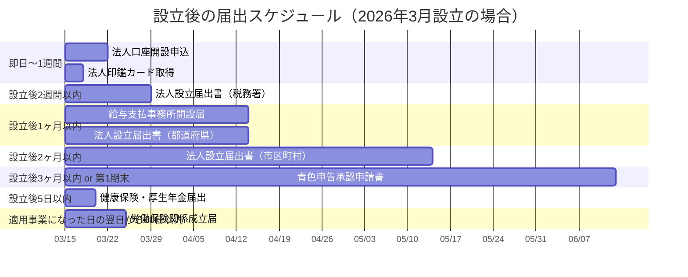

# 決算期・届出スケジュール

法人設立時に決める「決算期（事業年度）」の選び方と、設立後に必要な届出のタイムラインを整理する。

> ※要専門家確認: 決算期の選択は税務上の影響が大きいため、税理士と相談の上で決定してください。

---

## 1. 決算期（事業年度）の選び方

### 基本ルール
- 事業年度は1年以内であれば自由に設定可能
- 設立日〜最初の決算日が第1期となる
- 一度決めても定款変更で変更可能（ただし手間がかかる）

### 決算月の選定基準

| 基準 | 説明 | 推奨 |
|------|------|------|
| **設立月から最も遠い月** | 第1期を最長にし、消費税免税期間を最大化 | 強く推奨 |
| **繁忙期を避ける** | 決算作業と事業の繁忙期が重ならないように | 推奨 |
| **3月・12月を避ける** | 税理士の繁忙期のため、対応が遅れる可能性 | 推奨 |
| **税理士との相談** | 担当税理士の繁忙期を確認する | 推奨 |

### 設立月別の推奨決算月

| 設立月 | 推奨決算月 | 第1期の長さ | 理由 |
|--------|----------|-----------|------|
| 1月 | 12月 | 12ヶ月 | 第1期が最長、暦年と一致 |
| 2月 | 1月 | 12ヶ月 | 第1期が最長 |
| 3月 | 2月 | 12ヶ月 | 第1期が最長、3月決算を回避 |
| 4月 | 3月 | 12ヶ月 | 第1期が最長（ただし3月は税理士繁忙期） |
| 5月 | 4月 | 12ヶ月 | 第1期が最長 |
| 6月 | 5月 | 12ヶ月 | 第1期が最長 |
| 7月 | 6月 | 12ヶ月 | 第1期が最長 |
| 8月 | 7月 | 12ヶ月 | 第1期が最長 |
| 9月 | 8月 | 12ヶ月 | 第1期が最長 |
| 10月 | 9月 | 12ヶ月 | 第1期が最長 |
| 11月 | 10月 | 12ヶ月 | 第1期が最長 |
| 12月 | 11月 | 12ヶ月 | 第1期が最長、12月決算を回避 |

> ポイント: 設立月の前月を決算月にすると第1期が最長（約12ヶ月）になる。これにより消費税の免税期間を最大限活かせる。

### 2026年3月設立の場合の例

- **推奨決算月**: 2月
- **第1期**: 2026年3月〜2027年2月（12ヶ月）
- **第1期の法人税申告期限**: 2027年4月末
- **消費税免税**: 第1期（2027年2月末まで）＋第2期（2028年2月末まで）の最大約2年間 ※要専門家確認

---

## 2. 設立後の届出スケジュール

### タイムライン概要

### 詳細スケジュール

#### Phase 1: 登記完了日〜5日以内

| 届出先 | 届出書類 | 期限 | 必要添付書類 |
|--------|---------|------|------------|
| 年金事務所 | 健康保険・厚生年金保険 新規適用届 | 事実発生から5日以内 | 登記事項証明書、法人番号指定通知書 |
| 年金事務所 | 被保険者資格取得届 | 事実発生から5日以内 | |
| 年金事務所 | 被扶養者（異動）届 | 事実発生から5日以内 | 扶養者がいる場合 |

#### Phase 2: 登記完了後〜2週間以内

| 届出先 | 届出書類 | 期限 | 必要添付書類 |
|--------|---------|------|------------|
| 税務署 | 法人設立届出書 | 設立の日から2ヶ月以内 | 定款の写し、登記事項証明書等 |

#### Phase 3: 登記完了後〜1ヶ月以内

| 届出先 | 届出書類 | 期限 | 必要添付書類 |
|--------|---------|------|------------|
| 税務署 | 給与支払事務所等の開設届出書 | 開設の日から1ヶ月以内 | |
| 税務署 | 源泉所得税の納期の特例の承認申請書 | 随時（早めが望ましい） | 給与支給人員が常時10人未満の場合 |
| 都道府県税事務所 | 法人設立届出書 | 設立から15日〜1ヶ月以内（自治体による） | 定款の写し、登記事項証明書 |
| 市区町村 | 法人設立届出書 | 設立から1〜2ヶ月以内（自治体による） | 定款の写し、登記事項証明書 |

#### Phase 4: 登記完了後〜3ヶ月以内

| 届出先 | 届出書類 | 期限 | 備考 |
|--------|---------|------|------|
| 税務署 | 青色申告の承認申請書 | 設立から3ヶ月以内 or 第1期末のいずれか早い日の前日 | **必ず提出すること**（欠損金繰越等のメリット大） |
| 税務署 | 棚卸資産の評価方法の届出書 | 第1期の確定申告書提出期限まで | 必要に応じて |
| 税務署 | 減価償却資産の償却方法の届出書 | 第1期の確定申告書提出期限まで | 必要に応じて |
| 税務署 | 消費税課税事業者選択届出書 | 必要に応じて | 通常は免税事業者のため不要 |

---

## 3. 届出チェックリスト

### 最優先（設立後すぐ）
- [ ] 年金事務所: 健康保険・厚生年金保険 新規適用届（5日以内）
- [ ] 年金事務所: 被保険者資格取得届（5日以内）
- [ ] 法人口座開設の申し込み

### 高優先（1ヶ月以内）
- [ ] 税務署: 法人設立届出書
- [ ] 税務署: 給与支払事務所等の開設届出書
- [ ] 税務署: 源泉所得税の納期の特例の承認申請書
- [ ] 都道府県税事務所: 法人設立届出書
- [ ] 市区町村: 法人設立届出書

### 重要（3ヶ月以内）
- [ ] 税務署: 青色申告の承認申請書 **← 忘れると大きな損失**

### 任意・必要に応じて
- [ ] 税務署: 棚卸資産の評価方法の届出書
- [ ] 税務署: 減価償却資産の償却方法の届出書
- [ ] 労働基準監督署: 労働保険関係成立届（従業員を雇用する場合）
- [ ] ハローワーク: 雇用保険適用事業所設置届（従業員を雇用する場合）

---

## 4. 年間スケジュール（決算月が2月の場合）

| 月 | イベント |
|----|---------|
| 2月 | 決算月（棚卸し、決算準備） |
| 3月 | 決算作業、税理士と打合せ |
| 4月末 | **法人税・消費税・地方税の確定申告期限** |
| 6月 | 株主総会開催期限（株式会社の場合） |
| 8月末 | **中間申告・納付（前期の法人税が20万円超の場合）** |
| 11月 | 年末調整準備開始 |
| 12月 | 年末調整実施 |
| 1月末 | **法定調書・給与支払報告書提出期限** |
| 1月末 | **償却資産申告書提出期限** |

> ※要専門家確認: 申告期限は延長申請により変更可能な場合があります。

---

## 関連ドキュメント

- [[資金計画・初期費用シミュレーション]] — 費用の全体像
- [[税務・社会保険手続き]] — 届出の詳細
- [[法人設立チェックリスト]] — 設立手続きの全ステップ
