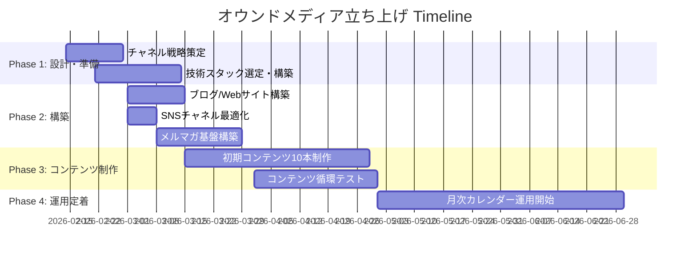

# Project: オウンドメディア立ち上げ

## Executive Summary
**一行説明**: DX/AIコンサルタントとしてのオウンドメディア6チャネルを体系的に立ち上げ、専門性発信と案件獲得の基盤を構築する。

**プロジェクトの目的**: ブログ・YouTube・X・LinkedIn・note・メルマガの6チャネルを統合運用し、コンテンツ循環モデルを確立する。DX実践知とAI活用実務の専門家としてのポジションを確立し、問い合わせ・案件獲得につなげる。

**想定成果**: 6チャネルの運用体制構築、初期コンテンツ10本の公開、コンテンツ循環モデルの確立。

## Goals & Success Metrics

### Primary Goals
1. 6チャネルすべてのアカウント開設・初期設定を完了する
2. コンテンツピラー4本を軸に初期コンテンツ10本を公開する
3. コンテンツ循環モデル（ブログ→YouTube→X→note→メルマガ）を実証する

### Success Criteria
- [ ] 全6チャネルが稼働状態（初期コンテンツ公開済み）
- [ ] ブログ月間PV 1,000達成
- [ ] YouTube登録者 100人達成
- [ ] Xフォロワー 500人達成
- [ ] メルマガ登録者 50人達成
- [ ] 月次コンテンツカレンダーの運用定着

## Stakeholders

| Role | Name | Responsibility |
|------|------|----------------|
| Owner | 舟越 | 全体統括・コンテンツ制作 |
| Audience | IT企業研修担当 | DX/AI研修導入検討層 |
| Audience | 個人クリエイター/エンジニア | AI活用・スキルアップ志向層 |
| Audience | 地方自治体DX担当者 | データ活用・DX推進層 |

## Deliverables

### Main Deliverables
- [ ] 成果物1: ブログ/Webサイト構築
  - 詳細: Next.js + Vercelでのサイト構築、独自ドメイン設定
  - 期限: 2026-03-15

- [ ] 成果物2: YouTube/SNSチャネル整備
  - 詳細: YouTube、X、LinkedIn、noteの各チャネル最適化
  - 期限: 2026-03-01

- [ ] 成果物3: メルマガ配信基盤
  - 詳細: メール配信サービス選定・設定、ランディングページ作成
  - 期限: 2026-03-31

- [ ] 成果物4: 初期コンテンツ10本
  - 詳細: 4ピラーに基づく初期コンテンツの制作・公開
  - 期限: 2026-04-30

## Timeline & Milestones

### Key Milestones
- [ ] Milestone 1: (2026-03-01) チャネル戦略・技術スタック確定
  - 達成条件: 全チャネルの役割・KPI・運用ルールが文書化されている

- [ ] Milestone 2: (2026-03-31) 全チャネル稼働開始
  - 達成条件: 6チャネルすべてで初期コンテンツが1本以上公開されている

- [ ] Milestone 3: (2026-06-30) コンテンツ循環モデル確立
  - 達成条件: 1つのコンテンツが3チャネル以上に展開される運用が定着

## Current Status

**Overall Progress**: 10%

[██░░░░░░░░░░░░░░░░░░] 10%

### This Week's Focus
- チャネル戦略の全体設計
- コンテンツピラーの定義
- 技術スタック比較検討

### Blockers & Risks
- Blocker: ブログ/Webサイトの技術スタック未決定
  - Impact: サイト構築着手が遅れる
  - Mitigation: 技術スタック選定ドキュメントで比較評価を実施

- Risk: コンテンツ制作の時間確保
  - Impact: クライアントワークとの両立
  - Mitigation: コンテンツ循環モデルで1素材から複数チャネルに展開

## Budget & Resources

### Budget
- 予算: 月額 ¥30,000（ツール・サービス）
- 初期投資: ¥50,000（ドメイン、機材等）

### Required Resources
- [ ] ツール・サービス: Vercel Pro、メール配信サービス、ドメイン
- [ ] 動画機材: マイク、照明（既存活用）
- [ ] 分析ツール: GA4、Search Console（無料）

## Related Documents
- [[01-planning/チャネル戦略-全体設計]]
- [[01-planning/コンテンツピラー設計]]
- [[01-planning/技術スタック選定]]
- [[01-planning/KPI・分析設計]]
- [[02-materials/初期コンテンツ10本計画]]
- [[05_Output/Areas/Content-Creation/Blog-Writing/00-content-strategy|ブログコンテンツ戦略]]
- [[05_Output/Areas/Content-Creation/YouTube-Channel/00-channel-strategy|YouTubeチャンネル戦略]]
- [[05_Output/Areas/Content-Creation/Note-Writing/00-note戦略|note戦略]]
- [[05_Output/Areas/Content-Creation/Social-Media/X-Twitter/content-calendar|Xコンテンツカレンダー]]

## Project Log

### 2026-02-14 - プロジェクト開始
- チャネル戦略、コンテンツピラー、技術スタック、KPI設計の初期ドキュメントを作成
- 初期コンテンツ10本の計画策定

## Next Actions
- [ ] 技術スタックの最終決定（Next.js + Vercel推奨構成の検証）
- [ ] 独自ドメインの取得
- [ ] メルマガ配信サービスの契約
- [ ] 初期コンテンツ1本目の制作着手
