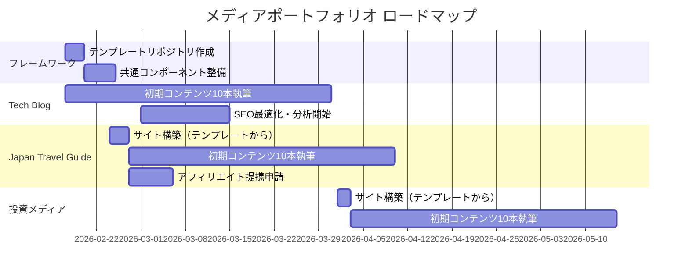

# メディアポートフォリオ戦略

## ビジョン

**再利用可能なメディア構築フレームワーク**を作り、複数ニッチサイトを効率的に量産・運営する。
各サイトは独立したブランドで運営し、収益はアフィリエイト＋広告＋リード獲得のミックスモデル。

---

## サイトポートフォリオ

| # | サイト名（仮） | ジャンル | 言語 | ターゲット | 収益モデル | 優先度 |
|---|---------------|---------|------|----------|----------|-------|
| 1 | Tech Blog | DX/AI/テクノロジー | 日本語 | エンジニア、DX推進者 | リード獲得 + アフィリエイト | ★★★ |
| 2 | Japan Travel Guide | 国内旅行（インバウンド） | 英語 | 訪日外国人 | アフィリエイト + 広告 | ★★★ |
| 3 | グルメメディア | 食・レストラン・食文化 | 日本語（+英語） | グルメ好き、訪日外国人 | アフィリエイト + 広告 | ★★★ |
| 4 | 投資メディア | 個人投資/資産運用 | 日本語 | 投資初心者〜中級者 | アフィリエイト + 広告 | ★★☆ |
| 5 | 趣味系（TBD） | 未定 | TBD | TBD | TBD | ★☆☆ |

---

## 量産フレームワーク設計

### 共通技術スタック

```
[共通テンプレート: Next.js + Tailwind + MDX]
     │
     ├── Site 1: Tech Blog (日本語)     → ~/Projects/own-media-blog/
     ├── Site 2: Travel Guide (英語)    → ~/Projects/japan-travel-guide/
     ├── Site 3: 投資メディア (日本語)  → ~/Projects/investment-media/
     └── Site 4: 趣味系 (TBD)          → ~/Projects/{hobby-site}/
```

### サイト作成テンプレート（再利用パーツ）

各サイトで共通化するもの：

| コンポーネント | 内容 | 再利用方法 |
|--------------|------|----------|
| **Next.js ボイラープレート** | App Router + MDX + gray-matter + reading-time | テンプレートリポジトリ |
| **SEO設定** | sitemap.xml, robots.txt, OGP画像生成 | 共通モジュール |
| **分析** | GA4 + Search Console 連携コード | 共通コンポーネント |
| **メルマガ** | ConvertKit/Resend 登録フォーム | 共通コンポーネント |
| **デプロイ** | Vercel 自動デプロイ（GitHub連携） | 手順テンプレート |
| **デザインシステム** | Tailwind ベースのUIコンポーネント | 共有パッケージ or コピー |

### 新サイト立ち上げフロー（自動化目標）

```
Step 1: テンプレートリポジトリをclone
Step 2: サイト固有の設定を変更（サイト名、ドメイン、カラー、ピラー）
Step 3: Vercelプロジェクト作成 + ドメイン接続
Step 4: GA4プロパティ作成 + Search Console登録
Step 5: 初期コンテンツ10本を投入
Step 6: 運用開始
```

**目標**: 新サイトを **半日** で立ち上げられる仕組み

---

## サイト別戦略

### Site 1: Tech Blog（構築済み）

- **パス**: `~/Projects/own-media-blog/`
- **ピラー**: DX実践知 / AI活用実務 / 起業ジャーニー / ナレッジ管理
- **詳細**: [[チャネル戦略-全体設計]] / [[コンテンツピラー設計]]
- **収益**: コンサルリード獲得（主） + SaaS/ツールアフィリエイト
- **ステータス**: Next.js構築済み、初期コンテンツ執筆待ち

### Site 2: Japan Travel Guide（インバウンド英語）

- **コンセプト**: 訪日外国人向けの日本国内旅行ガイド
- **言語**: 英語（メイン）、将来的に多言語展開も視野
- **差別化**:
  - ローカルの視点（観光客向けガイドではなく、地元民が案内する感覚）
  - AI翻訳ではない自然な英語
  - NTTDXの地方案件で得た地方知識の活用
- **ピラー候補**:
  1. Hidden Gems — 穴場スポット、地方の魅力
  2. Food & Drink — 地域グルメ、居酒屋文化、食の体験
  3. Practical Tips — 交通、マナー、通信、モバイル決済
  4. Seasonal Events — 祭り、花見、紅葉、雪景色
- **収益モデル**:
  - ホテル予約アフィリエイト（Booking.com, Agoda, 楽天トラベル）
  - ツアー予約（Klook, GetYourGuide, Viator）
  - SIMカード/eSIM/Wi-Fiアフィリエイト
  - AdSense/Mediavine（トラフィック成長後）
- **SEOキーワード例**:
  - "best hidden places in Japan"
  - "Japan travel tips 2026"
  - "off the beaten path Japan"
  - "best food in [city name]"

### Site 3: グルメメディア

- **コンセプト**: 食を軸にした体験型メディア。日本語メインだが旅行サイトとの相互送客で英語コンテンツも展開
- **差別化**:
  - 地方案件で訪れた各地のローカルグルメの一次情報
  - テクノロジー活用（AI食べログ分析、予約最適化Tips等）
  - 旅行サイトとのクロスリンクで「旅 × 食」のシナジー
- **ピラー候補**:
  1. ローカルグルメ — 地方の隠れた名店、ご当地グルメ
  2. 食文化・食体験 — 居酒屋文化、市場巡り、料理体験
  3. レストランレビュー — 実際に訪問した店の率直なレビュー
  4. フードテック — AI予約、食のサブスク、デリバリー比較
- **収益モデル**:
  - グルメ予約アフィリエイト（食べログ、一休レストラン、OZmall）
  - ホットペッパーグルメ等の送客
  - AdSense
  - 旅行サイトとの相互送客
- **旅行サイトとのシナジー**:
  - Travel Guide → グルメ記事へリンク「Best food in [city]」
  - グルメ → Travel Guide へリンク「[city]の観光ガイド」

---

### Site 4: 投資メディア（個人投資/資産運用）

- **コンセプト**: テクノロジー視点の個人投資・資産運用ガイド
- **差別化**:
  - エンジニア/テック系の人向けの投資入門
  - データ分析的アプローチ（Pythonでの分析、可視化）
  - AIを活用した投資情報収集の方法
- **ピラー候補**:
  1. 投資入門 — NISA、iDeCo、インデックス投資の基礎
  2. テック投資 — テクノロジーセクター分析、AI関連銘柄
  3. 投資×テクノロジー — Python分析、API活用、自動化
  4. マネーリテラシー — 税金、確定申告、法人の資産運用
- **収益モデル**:
  - 証券口座開設アフィリエイト（SBI, 楽天, マネックス）
  - 投資ツール/サービスアフィリエイト
  - AdSense
- **注意**: 金融商品取引法に抵触しないよう、投資助言にならない表現に留意

### Site 5: 趣味系（TBD）

- **コンセプト**: フレームワーク確立後に展開
- **選定基準**:
  - アフィリエイト単価が高いジャンル
  - 自身の興味・経験があるテーマ
  - 競合が比較的少ないニッチ

---

## 横断KPI

| 指標 | 3ヶ月目標 | 6ヶ月目標 | 12ヶ月目標 |
|------|---------|---------|----------|
| サイト数 | 2（Tech + Travel） | 4（+ Gourmet + Finance） | 5（+ Hobby） |
| 総月間PV | 5,000 | 30,000 | 100,000 |
| 総月間収益 | ¥10,000 | ¥100,000 | ¥500,000 |
| 記事総数 | 30 | 80 | 200 |

---

## ロードマップ



---

## 関連ドキュメント

- [[チャネル戦略-全体設計]] — Tech Blog のチャネル戦略
- [[コンテンツピラー設計]] — Tech Blog のピラー設計
- [[技術スタック選定]] — 共通技術スタック
- [[KPI・分析設計]] — 分析フレームワーク
- [[05_Output/Projects/@Active/Own-Business-Planning/01-planning/収益モデル設計|収益モデル設計]] — 事業全体の収益モデル

---

**最終更新**: 2026-02-14

#media-portfolio #strategy #owned-media
